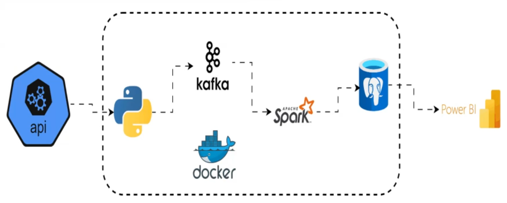

# Real-Time Stock Market Analysis

## Overview
This project implements a **real-time data pipeline** for stock market analysis. It fetches intraday (5-minute interval) stock price data from the Alpha Vantage API for multiple tickers (e.g., TSLA, MSFT, GOOGL), processes the JSON responses into structured records, and prepares the data for streaming and storage.

The pipeline is fully containerized using Docker Compose, including:
- Apache Kafka for streaming (single-node KRaft mode, no Zookeeper)
- Apache Spark for distributed processing (master + worker nodes)
- A custom Spark streaming consumer to read from Kafka
- PostgreSQL for data storage
- pgAdmin for database management
- Kafka UI for monitoring topics and messages

Future extensions could include integrating Power BI for visualization or adding more advanced analytics in Spark.

## Data Pipeline Architecture
  

## Project Tech Stack & Flow
- **Alpha Vantage API** → Fetches real-time stock data (producer scripts in Python).
- **Kafka** → Streams JSON events from the producer (topics for raw and processed data).
- **Spark Streaming** → Consumes from Kafka, performs transformations/aggregations, and writes results to PostgreSQL.
- **PostgreSQL** → Stores cleaned/analyzed data for querying and reporting.
- **pgAdmin** → Web-based tool to manage and visualize the PostgreSQL database.
- **Kafka UI** → Browser-based interface to inspect topics, messages, and cluster health.
- **Power BI** (external/optional) → Connects to PostgreSQL for creating dashboards and visualizations.

The flow:
1. Producer pulls data from API and sends to Kafka topic.
2. Spark consumer reads from Kafka, processes (e.g., aggregations, filtering), and sinks to Postgres.
3. Query Postgres for insights or connect BI tools.

## Prerequisites
- **Python 3.10+** installed (for running the producer locally).
- **Docker Desktop** installed and running (for the containerized environment).
- **Git** for cloning the repo.
- Alpha Vantage API key (free tier available at [alphavantage.co](https://www.alphavantage.co/support/#api-key)) — add to `.env` file.
- Basic knowledge of Docker, Python, and command line.
